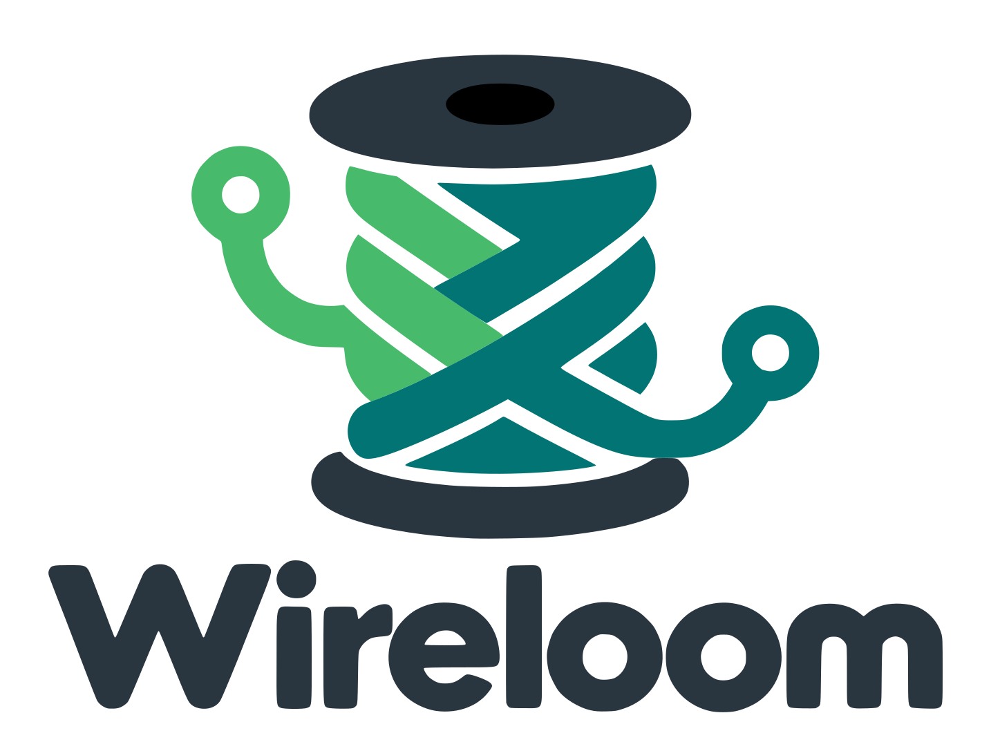
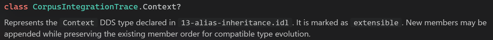
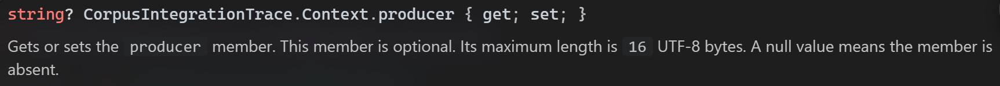

# Wireloom

<!-- markdownlint-disable-next-line MD033 -->


[](https://github.com/eNeRGy164/wireloom/actions/workflows/quality.yml)
[](https://coveralls.io/github/eNeRGy164/wireloom?branch=main)
[](https://www.nuget.org/packages/Wireloom.Dds.Generator)
[](https://scorecard.dev/viewer/?uri=github.com/eNeRGy164/wireloom)

**Replace `rtiddsgen` in your C# build. Keep RTI Connext DDS.**

Wireloom brings IDL generation into the .NET compiler for **.NET 8 and higher**.
It generates your C# data types and RTI type-specific support from IDL during a normal build, with
rich IntelliSense documentation, modern C#, and a small NuGet package. For
supported IDL contracts, it replaces the complete C# generation step:
preprocessing, parsing, validation, and emission.

The RTI Connext DDS runtime still provides serialization and DDS communication.
Your application continues to use RTI's runtime, APIs, and configuration.

## Why Wireloom?

- **Understand your contracts without leaving the editor.** Generated XML
  documentation explains DDS keys, optional presence, string and collection
  bounds, defaults, member IDs, and union branch selection. Remarks, examples,
  exception documentation, and RTI API links put the contract beside the code
  you are writing.
- **Keep strict C# builds clean.** Generated code uses nullable reference types,
  file-scoped namespaces, collection expressions, and current .NET APIs. In the
  latest corpus Qodana run, Wireloom had **6 remaining warnings** after
  excluding collision-safe `global::` qualifiers, RTI-parity hashing findings,
  and intentional partial declarations. For comparison, the earlier matched
  RTI scan reported **8,544 total findings**. See the [measurement and
  scope](docs/corpus/csharp-quality.md) for the scan details.
- **Add generation in two project entries.** One `PackageReference` and one
  `DdsIdl` item connect IDL to the build. Includes and defines are declarative
  MSBuild settings. Generation needs no custom `Exec` target, generator
  installation paths, or toolchain environment variables.
- **Work directly from IDL.** Roslyn exposes generated documents in the IDE;
  diagnostics point back to the IDL or included file. Root and include changes
  are tracked as compiler inputs, so regeneration belongs to the normal build.
- **Extend your types without editing generated files.** Generated data classes
  are `partial`, so application helpers can live in separate, maintained C#
  files and survive regeneration.

RTI's generator serves multiple languages, platforms, and release toolchains.
Wireloom focuses on the C# developer experience within that ecosystem. The
benefit is a smaller generation setup and C# output that fits naturally into
today's .NET tooling.

### See the DDS contract in IntelliSense

Hover over a generated type to see where it was declared and how its
extensibility affects compatible type evolution:



Hover over a member to see the details that matter when assigning values.
Here, `producer` is optional, its bound is **16 UTF-8 bytes**, and `null` means
the member is absent:



### A smaller generation setup

The local Wireloom 0.3.0 package measured **169,012 bytes (about 170 kB)**.
For scale, RTI documents an approximately **2 GB Connext installation** in an
[example development setup](https://www.rti.com/hubfs/_Collateral/Simplified-Real-Time-Data-Sharing.pdf).
That example concerns Connext 6.1; installation size varies by release,
platform, and selected components. This compares a full development
installation with a compressed generator package. Both approaches still need
the .NET SDK and the RTI runtime for the application.

| Generation concern | External `rtiddsgen` workflow | Wireloom workflow |
| :-- | :-- | :-- |
| Tool provisioning | Install or provide the RTI code generator and its Java tooling | Restore one small NuGet generator package |
| IDL preprocessing | Configure the external C/C++ preprocessor when needed | Managed preprocessing inside the generator |
| Build integration | Invoke the generator and manage tool paths, arguments, outputs, and generated compile inputs | Declare the package and IDL roots in the project |
| Generated files | Generate physical C# files and arrange their inclusion in the build | Roslyn generated documents; optional export for inspection |
| Error navigation | Surface external-tool output through your build integration | Source-located compiler diagnostics for IDL and includes |

RTI's [C# getting-started guide](https://community.rti.com/static/documentation/connext-dds/current/doc/manuals/connext_dds_professional/getting_started_guide/csharp/intro_pubsub_csharp.html)
describes generator invocation, path setup, and external preprocessing. Existing
projects may already automate these steps; Wireloom makes them part of the
package's compiler integration.

### Wide-character union support

Wireloom accepts the `wchar` discriminator case that the retained RTI 7.7.0.1
generator rejects before C# emission
([C113](docs/corpus/idl/features/07-union-wchar-label.idl)). This is a
generation extension; consult the separate wire evidence before adopting it.

## Get started

Add the generator and RTI runtime to the project that owns your DDS contracts.
The runtime reference is explicit because your application controls its runtime
version and configuration.

```xml
<Project Sdk="Microsoft.NET.Sdk">
  <PropertyGroup>
    <TargetFramework>net8.0</TargetFramework>
    <LangVersion>12.0</LangVersion>
  </PropertyGroup>

  <ItemGroup>
    <PackageReference Include="Rti.ConnextDds" Version="7.7.0" />
    <PackageReference Include="Wireloom.Dds.Generator"
                      Version="0.3.0"
                      PrivateAssets="all" />
    <DdsIdl Include="Contracts\Telemetry.idl" />
  </ItemGroup>
</Project>
```

For example, `Contracts\Telemetry.idl` can contain:

```idl
module Telemetry {
  struct Sample {
    long id;
    string<64> label;
    sequence<float, 8> values;
  };
};
```

The `DdsIdl` item identifies a generation root. Files included by that root are
tracked as inputs but are not generated as independent roots. For include
directories and preprocessing options, see the [package usage guide](src/Wireloom.Dds.Generator/README.md).

Generated source appears in the IDE as Roslyn generated documents. To write it
under `obj` for inspection, add:

```xml
<PropertyGroup>
  <EmitCompilerGeneratedFiles>true</EmitCompilerGeneratedFiles>
  <CompilerGeneratedFilesOutputPath>$(BaseIntermediateOutputPath)generated</CompilerGeneratedFilesOutputPath>
</PropertyGroup>
```

## Support and compatibility

Compatibility is tracked per IDL feature. Wireloom supports modules, structs,
aliases, enums, unions, constants, collections, arrays, optional aggregate
members, aggregate typedef aliases, and preprocessing.
Unsupported declarations are reported with diagnostics instead of being
silently omitted.

Check the [feature coverage index](docs/corpus/FEATURE-COVERAGE.md) for the
current status of individual IDL shapes. The checked compatibility corpus uses
RTI Connext DDS 7.7.0 / `rtiddsgen` 4.7.0 reference output. Use RTI **7.7.0** as
the tested runtime baseline; the package's minimum-version guard of 7.3.1 is
not a claim that every generated API works with older releases.
Optional aggregate support is covered by
[C115](docs/corpus/idl/features/09-optional-aggregate-member.idl).

Consumer projects can target **.NET 8 and higher** and must use **C# 12 or
later**. The generator package targets `netstandard2.0` for Roslyn host
compatibility. The repository's default build and corpus/wire verification
projects use .NET 10; that is the maintainer baseline, not the minimum consumer
framework. The [package integration suite](tests/Wireloom.Dds.Generator.PackageIntegration/README.md)
also passes when targeting .NET 8 with C# 12, using the repository's pinned SDK.

Corpus results compare source-generation behavior and generated C# shape. They
do not establish serialization-byte equivalence, live DDS behavior, or C++
interoperability. The separate [wire compatibility matrix](tests/Wireloom.Dds.Generator.WireCompatibility/README.md)
tests fixture values across all nine directed pairings of Wireloom C#,
RTI-generated C#, and RTI C++ peers on exact RTI 7.7.0. Consult its
[workflow reports](https://github.com/eNeRGy164/wireloom/actions/workflows/wire-compatibility.yml)
for executed outcomes, known failures, and peer adaptations.

Before replacing existing generated code, check your IDL shapes and public API
usage against that evidence. Direct arrays of sequences retain a known mapping
limitation; use a sequence typedef before declaring the array. Wireloom is not
yet a universal drop-in replacement for every `rtiddsgen` option or generated
API shape.

## Documentation

- [Package usage and configuration](src/Wireloom.Dds.Generator/README.md)
- [Feature coverage](docs/corpus/FEATURE-COVERAGE.md)
- [Generated C# quality comparison](docs/corpus/csharp-quality.md)
- [Wire compatibility matrix](tests/Wireloom.Dds.Generator.WireCompatibility/README.md)
- [Preprocessor feature matrix](docs/PREPROCESSOR-FEATURES.md)
- [Code style](docs/CODE-STYLE.md)
- [Architecture overview](docs/architecture/arc42/index.md)
- [Incremental generator baseline](docs/performance/incremental-generator-baseline.md)
- [Contributing and maintainer guide](CONTRIBUTING.md)

## License

Wireloom is licensed under the [MIT License](LICENSE). That license does not
apply to the RTI-generated oracle sources in [`docs/corpus/oracles`](docs/corpus/oracles)
or other third-party materials. Review the [corpus guidance](docs/corpus/README.md)
before redistributing or changing those reference artifacts.
